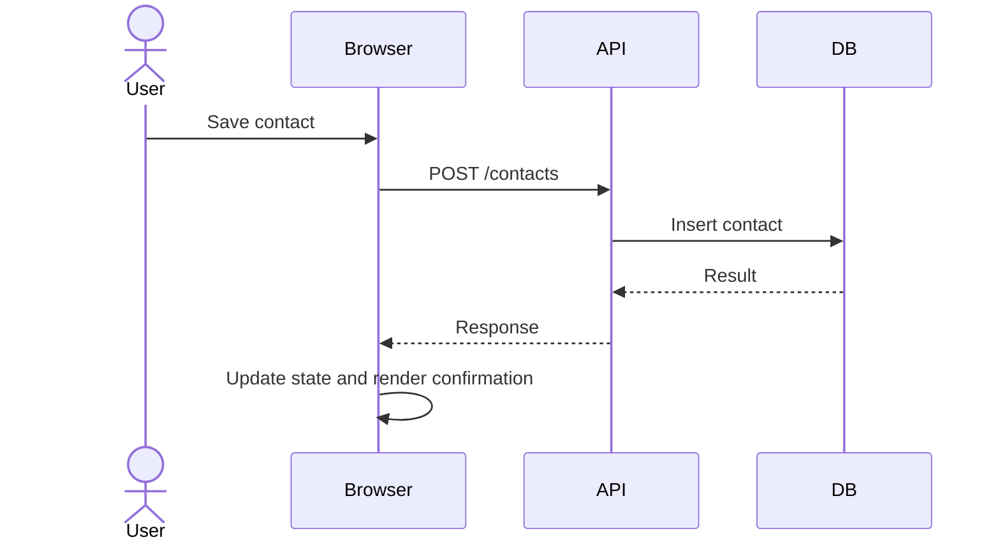

# Visual communication

Use Mermaid diagrams when they materially improve understanding in:

- PR descriptions;
- OpenSpec proposals and changes;
- ADRs;
- user and developer documentation;
- repository architecture and onboarding documentation;
- tracing, propagation, authentication, initialization, and lifecycle explanations.

Prefer the simplest diagram type that fits:

- `sequenceDiagram` for browser/API/database and initialization order;
- `flowchart` for ownership, decisions, and boundaries;
- `stateDiagram-v2` for readiness or lifecycle states;
- `journey` for user-facing workflows;
- `gitGraph` for release or migration sequencing.

Do not add a diagram that merely restates nearby prose. Keep node labels short, avoid sensitive values, and ensure the diagram renders in the target platform.

## Example

